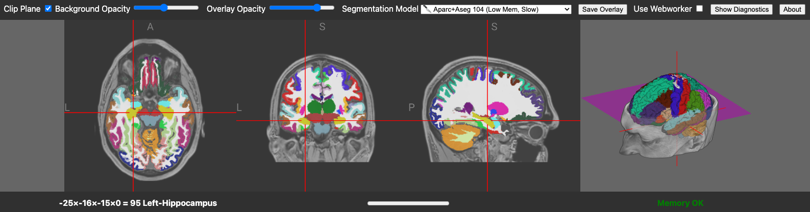

# NiiVue brainchop

<span style="color: red">**This repository is archived. Features developed here have been merged with the main [brainchop repository](https://github.com/neuroneural/brainchop)**</span>

This is an experimental version of [brainchop](https://github.com/neuroneural/brainchop) that uses [NiiVue](https://github.com/niivue/niivue) to segment and visualize voxel based images. 

## Usage

1. Open the [live demo](https://niivue.github.io/niivue-brainchop/).
2. **Option 1** The web page automatically loads with a default T1 MRI scan. If you want to use this scan, go to step 5.
3. **Option 2** If your T1 MRI scan is in NIfTI format, drag and drop the file onto the web page.
4. **Option 3** If your image is in DICOM format, it may load if you drag and drop the files. If this fails, convert your images with dcm2niix.
5. Segment your brain scan by choosing a model from the `Segmentation Model` pull-down menu. Not all models with with all graphics cards. The `Tissue GWM (High Acc, Low Mem)` is a good starting point. Hopefully, it will accurately segment your brain into gray matter, white matter and cerebral spinal fluid.
6. Press the `Create Mesh` button and select your preferred settings: 

 - [Closing](https://en.wikipedia.org/wiki/Closing_(morphology)) removes small crevices and cavities in your mesh which can plague printing.
 - Fill bubbles will remove any cavities, this includes large cavities for example the ventricles for a brain scan.
 - The `Largest cluster only` will only extract a single mesh. For example, with the `Iguana` demo this extracts only the skull without the [scleral rings](https://en.wikipedia.org/wiki/Scleral_Ring).
 - You can choose `Smoothing` to make the surfaces less jagged (note this can create self intersecting triangles that can confound some printers).
 - You can choose to `Simplify` [reduce the number of triangles](https://github.com/sp4cerat/Fast-Quadric-Mesh-Simplification) to create smaller files (note this can create self intersecting triangles that can confound some printers).
7. Once you have set your preferences, press `Apply`.
8. You will see the mesh appear and can interactively view it. If you are unhappy with the result, repeat step 6 with different settings. If you want to print the results, press the `Save Mesh` button.

### To run

```bash
git clone git@github.com:niivue/niivue-brainchop.git
cd niivue-brainchop
npm install
npm run dev
```

Use the `Segmentation Model` pull down menu to run different tissue classifications.




### To build

```bash
npm run build
```


